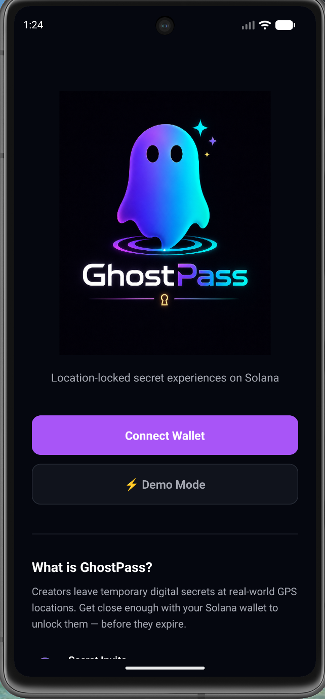
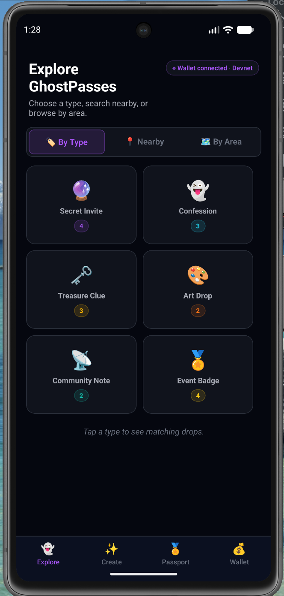
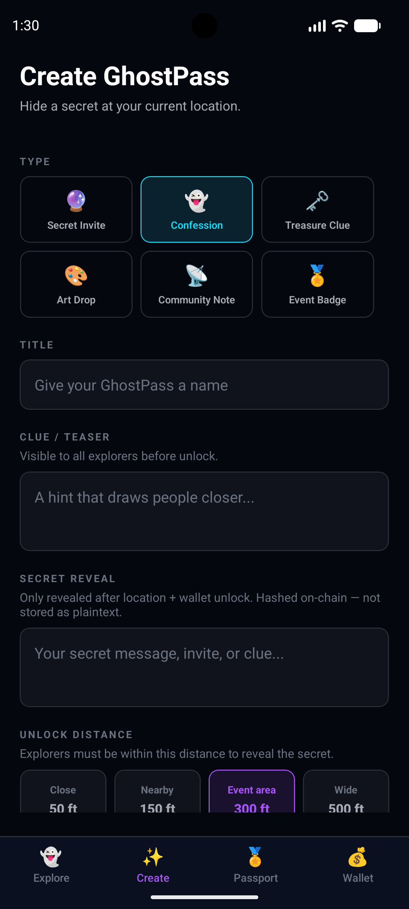
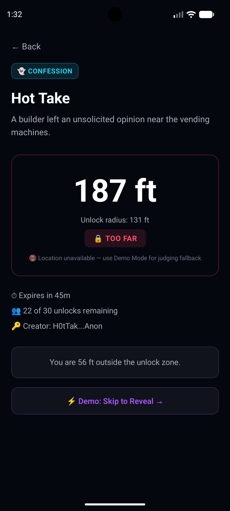
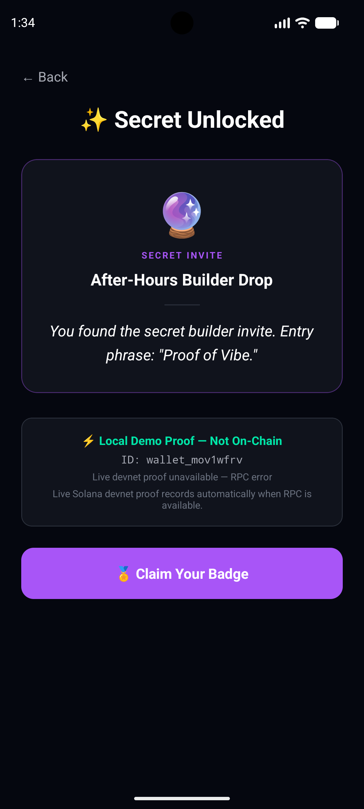
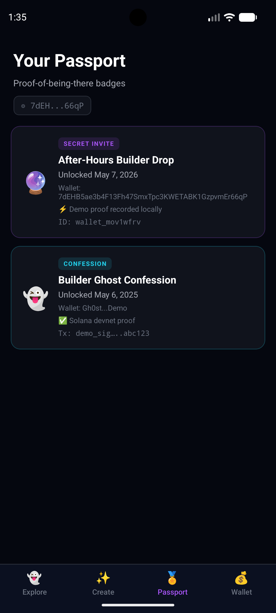
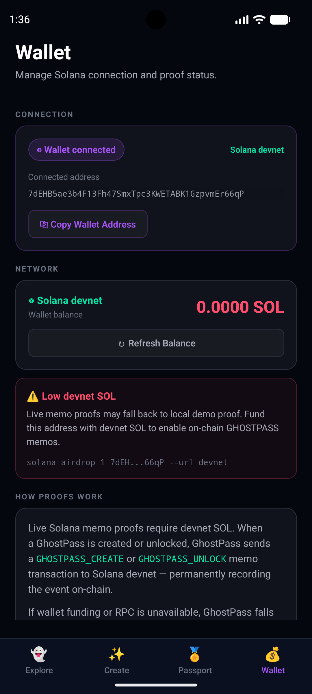

# GhostPass

**Short summary :** GhostPass hides temporary secrets at GPS locations. Get close, sign with your Solana wallet, unlock the secret — before it expires.

---

## What is GhostPass?

GhostPass turns the physical world into a programmable layer for temporary secret experiences. Creators leave digital secrets — invites, confessions, treasure clues, art drops, community notes, and proof-of-presence event badges — at real-world GPS locations. Explorers physically walk to the location, connect their Solana wallet, and unlock the secret before it expires. Every create and unlock event is recorded as a Memo transaction on Solana devnet. GhostPass is built for the Solana Mobile Track and runs on Android using React Native / Expo with full Mobile Wallet Adapter integration.

---

## Demo Video

Demo video with audio: **Coming before final submission**

This video will show:
1. Connecting through Solana Mobile Wallet Adapter using the Android fakewallet.
2. Creating a GhostPass with a GPS unlock radius.
3. Discovering a GhostPass through Explore.
4. Unlocking through the distance gate.
5. Recording a Solana devnet memo proof when funding/RPC is available.
6. Falling back to **Local Demo Proof — Not On-Chain** when devnet funding/RPC is unavailable.
7. Claiming a proof badge in Passport.
8. A brief walkthrough of the repository structure.

## Screenshots

| Landing / Connect | Explore by Type | Create GhostPass |
|---|---|---|
|  |  |  |

| Distance Gate | Secret Reveal Proof | Passport Badge |
|---|---|---|
|  |  |  |

| Wallet / Devnet Status |
|---|
|  |

---

## Wallet Connection

GhostPass uses **Solana Mobile Wallet Adapter (MWA)** for real wallet connections on Android.

- **Connect Wallet** calls `transact()` + `wallet.authorize({ chain: 'solana:devnet' })` from `@solana-mobile/mobile-wallet-adapter-protocol`.
- The connected wallet's public key is stored and displayed throughout the app.
- The auth token is stored in a session-scoped ref and used to reauthorize for each subsequent signing request.

**Create GhostPass** and **Unlock GhostPass** both:
1. Build an unsigned devnet memo transaction with the connected wallet as the fee payer.
2. Open a new MWA session (`transact()`), reauthorize with the stored token, and call `wallet.signTransactions()`.
3. Submit the wallet-signed transaction to Solana devnet and display the confirmed tx signature.

If MWA signing fails for any reason (no wallet app, auth token expired, user rejected, RPC timeout), the app falls back to a demo keypair and labels the result clearly as **"Local Demo Proof — Not On-Chain"**.

---

## Demo Mode

Tap **Demo Mode** on the landing screen to skip wallet connection entirely. Demo Mode uses:
- A fake public key for display
- An ephemeral demo keypair for transaction signing (not a real wallet)
- The same devnet RPC; proof falls back to a local ID if devnet is rate-limited

All demo proofs are labeled "Local Demo Proof — Not On-Chain" so there is no confusion with real wallet-signed transactions.

---

## MWA Testing on Android Emulator (fakewallet)

MWA signing was tested on the **Android emulator** (Pixel_7, arm64, API 37) using the official Solana Mobile **fakewallet** APK. No physical Android device is required.

### Why fakewallet

- Official test wallet from the `solana-mobile/mobile-wallet-adapter` repo.
- Pure JVM APK (no NDK) — works on arm64 and x86_64 emulators.
- Implements the full MWA protocol: authorize, reauthorize, signTransactions.
- Shows real approve/decline dialogs so the full user flow is exercised.
- Uses a randomly generated devnet keypair; auto-requests airdrops.

### Prerequisites

- Android Studio with the Pixel_7 emulator (API 33+, arm64 or x86_64).
- `adb` in PATH: `export PATH=$PATH:$ANDROID_HOME/platform-tools`
- GhostPass built and installed on the emulator.

### Step 1 — Start the emulator

```bash
/Users/bellynap/Library/Android/sdk/emulator/emulator -avd Pixel_7 &
# Wait for it to fully boot, then verify:
adb wait-for-device
adb devices
```

### Step 2 — Set a screen lock (REQUIRED — MWA will fail without it)

MWA walletlib requires a screen lock before authorizing any dApp.

```
Emulator → Settings → Security & Privacy → Device Unlock → Screen Lock → PIN
```

Set any PIN (e.g. `1234`). You only need to do this once per emulator wipe.

### Step 3 — Download and install fakewallet

```bash
curl -L -o fakewallet-v1-debug.apk \
  "https://github.com/solana-mobile/mobile-wallet-adapter/releases/download/@solana-mobile/mobile-wallet-adapter-walletlib@1.4.3/fakewallet-v1-debug.apk"

adb -s emulator-5554 install fakewallet-v1-debug.apk

# Verify:
adb shell pm list packages | grep fakewallet
# Expected: package:com.solana.mobilewalletadapter.fakewallet
```

### Step 4 — Build and install GhostPass

```bash
ANDROID_HOME=/Users/bellynap/Library/Android/sdk npx expo run:android
```

### Step 5 — Test Connect Wallet

1. Open GhostPass on the emulator.
2. Tap **Connect Wallet**.
3. The emulator switches to the fakewallet app showing a connection request from "GhostPass".
4. Tap **Authorize** in fakewallet.
5. GhostPass resumes — the Feed screen shows the connected wallet address (fakewallet's devnet pubkey).

### Step 6 — Test Create GhostPass (real wallet signing)

1. Tap the **Create** tab.
2. Fill in Type, Title, Clue, and Secret Reveal fields.
3. Tap **Create & Record on Solana**.
4. GhostPass shows "Recording Proof… — Open your wallet app to approve".
5. The emulator switches to fakewallet showing a **Sign Transaction** request.
6. Tap **Sign** in fakewallet.
7. GhostPass resumes and shows: `✅ Solana Proof Recorded · DEVNET TRANSACTION · <tx sig>`.
8. Copy the transaction signature.

### Step 7 — Test Unlock (real wallet signing)

1. From the Feed, tap any GhostPass card.
2. If location simulation is off, enable **Simulate Nearby** in the Feed header.
3. Tap **Unlock GhostPass** on the Detail screen.
4. GhostPass shows "Recording Proof… — Open your wallet app to approve".
5. The emulator switches to fakewallet for a Sign Transaction request.
6. Tap **Sign** in fakewallet.
7. GhostPass shows the Secret Reveal screen with: `✅ Solana Proof Recorded · Tx: <sig>`.

### Step 8 — Verify the signer on Solana Explorer

1. Open: `https://explorer.solana.com/tx/<signature>?cluster=devnet`
2. Under **Account Inputs**, the first signer is the **fakewallet's devnet public key** — this matches the address displayed in GhostPass after connecting, NOT the ephemeral demo keypair.
3. The Memo instruction data contains `"type":"GHOSTPASS_CREATE"` or `"GHOSTPASS_UNLOCK"` and the `"creatorWallet"` field.

This confirms the transaction was signed by the MWA-connected wallet, not the internal demo keypair.

### Fallback verification

1. Disconnect from fakewallet (or use Demo Mode).
2. Create a GhostPass — the app falls back and shows: `⚡ Local Demo Proof — Not On-Chain`.
3. There is no Solana Explorer link because no transaction was submitted.

---

## Build

```bash
# Android emulator
ANDROID_HOME=/Users/bellynap/Library/Android/sdk npx expo run:android

# TypeScript check
npx tsc --noEmit
```

---

## Architecture

| Layer | Technology |
|---|---|
| Framework | Expo SDK 54, React Native 0.81, React 19 |
| Navigation | React Navigation v7 (native-stack + bottom-tabs) |
| Wallet | `@solana-mobile/mobile-wallet-adapter-protocol` v2.2.8 |
| On-chain | `@solana/web3.js` v1.98.4 · Solana Memo Program |
| Network | Solana devnet |
| State | React Context for app state; AsyncStorage for wallet session persistence |

---

## On-Chain Proof Format

Every Create and Unlock records a JSON memo via the Solana Memo Program:

```json
// GHOSTPASS_CREATE
{
  "type": "GHOSTPASS_CREATE",
  "passId": "gp_user_...",
  "ghostPassType": "Confession",
  "title": "...",
  "creatorWallet": "<wallet pubkey>",
  "locationHash": "demo_location_v1",
  "expiresAt": "...",
  "maxUnlocks": 20,
  "contentHash": "mvp_xxxxxxxx"
}

// GHOSTPASS_UNLOCK
{
  "type": "GHOSTPASS_UNLOCK",
  "passId": "gp_...",
  "wallet": "<wallet pubkey>",
  "timestamp": "..."
}
```

Secret reveal text and exact GPS coordinates are **never stored on-chain**.

---

## Setup

```bash
# 1. Install dependencies
npm install

# 2. Build and run on Android emulator (requires Android SDK + emulator running)
ANDROID_HOME=/Users/YOUR_USERNAME/Library/Android/sdk npx expo run:android

# 3. TypeScript check
npx tsc --noEmit
```

Requires: Node.js 18+, JDK 17, Android Studio with an API 33+ emulator. See the MWA Testing section for fakewallet setup.

---

## Known Limitations

- **GPS anti-spoofing:** GPS is a mobile-native proximity gate for the MVP. It is not fraud-proof. Production roadmap includes device attestation and anti-spoofing.
- **Secret storage:** Secrets are stored in local app state (in-memory, no persistence). A production version would use encrypted decentralized storage.
- **Content hash:** The on-chain `contentHash` uses a djb2 hash (labeled `mvp_`). It is not cryptographic SHA-256. It prevents the secret from being readable on-chain but is not production-grade.
- **Location hash:** The `locationHash` field in the Memo is `demo_location_v1` (a static placeholder). A production version would use a geohash or approximate region label.
- **Devnet only:** All Solana interaction is on devnet. No mainnet or real SOL is involved.
- **Faucet rate limits:** Devnet airdrop is rate-limited at events. If the proof fails, the app falls back to a clearly labeled "Local Demo Proof — Not On-Chain" and no transaction is submitted.
- **In-memory state:** Pass and badge data resets on app restart (no AsyncStorage persistence for pass data). Wallet session is persisted via AsyncStorage.
- **Package name:** Currently `com.anonymous.ghostpass` from the Expo blank template. Production build would use a custom package name.
